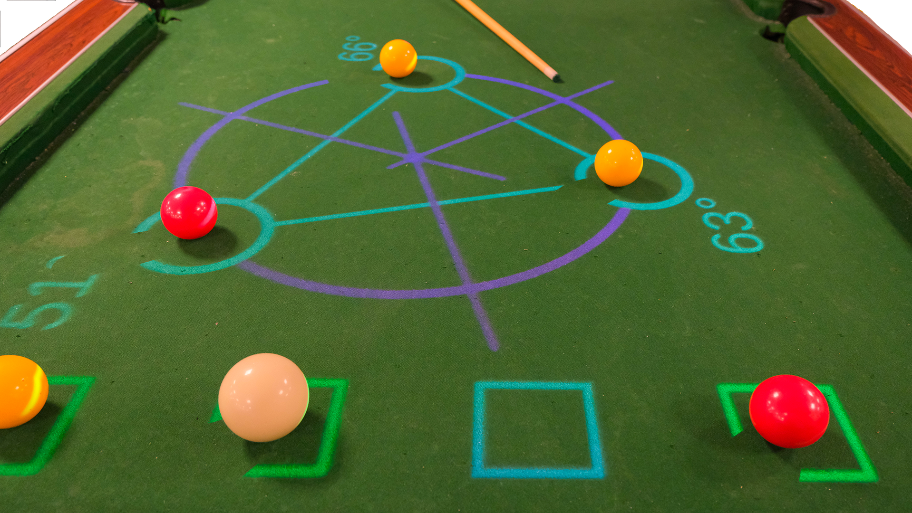
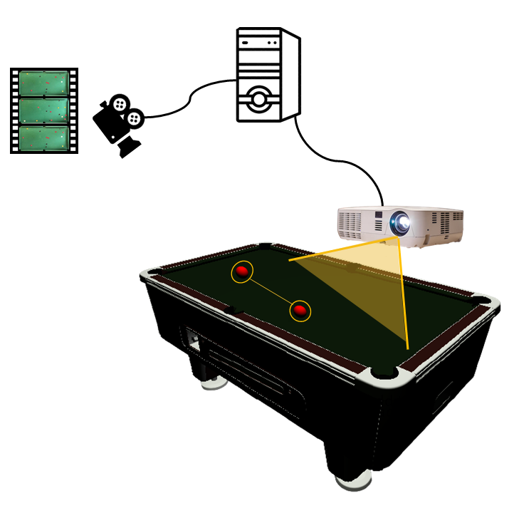
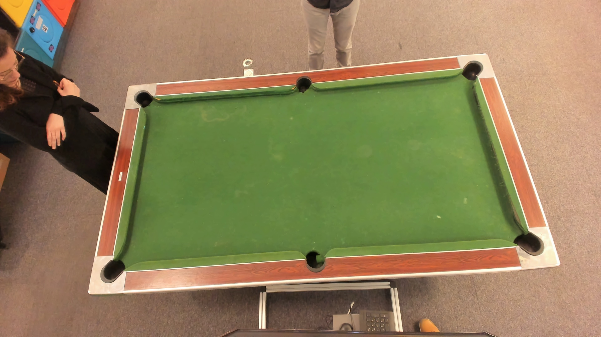

---

## Basic Overview

The interactive pool is a mathematics and physics learning platform using gamification. A projector, a camera and an artificial intelligence transform any pool table into an augmented reality platform.

Get to know more about the interactive pool project on [DVIC webstite](https://dvic.devinci.fr/projects/educationnal-billard)

## Clone the code

To clone the project :

1. clone GOSAI repository `git clone https://github.com/GOSAI-DVIC/gosai`
2. clone Interactive Pool platform
`cd gosai`
`git clone https://github.com/GOSAI-DVIC/interactive-pool home`

3. Install the requires librairies `make install`

## Launch the interactive pool

Simply enter `make stop && make boot` on the terminal

To start an application : `start <app_name>`
To stop  an application : `stop <app_name>`

## Hardware : a Camera-projector system

The interactive pool function thanks to a camera-projector system :

*Camera-Projector System*

 

Camera and videoprojector must be positionned up to the pool table, on the middle. The camera must have the entire table perimeter in view.
Here are two tasks to perform while installing or moving the camera-projector system on the interactive pool.

### Calibration of the interactive pool

It is possible to calibrate the interactive pool using the **calibration module** of GOSAI (see : `core/calibration`)
This module can calibrate any camera-projector system, and has been especially designed for the interactive pool.

**Quick calibrate the interactive pool :** `make calibration`

The calibration is semi-automatic, it is separated in two phases:
1. a rectangle cropping (= to focus on the working area)
2. the calibration of the projector from the camera point of view.

During the first phase, you will have to manually select the table area (= corners of the pool)
During the second phase, aruco patterns will be projected on the pool and automatically detected by the camera.

The algorithm automatically associate projected and detected points to calculate an homographic matrix.
All the calibration data are stored in `calibration.json`.

### Capture empty background

If you move the camera-projector system, you will have to take a new shot of the pool with empty objects on it. This picture is used by the ball and cue drivers to perform the object detection.

To update the empty background : 
1. Remove any objects on the pool table
2. `make background`

*Empty Background*
