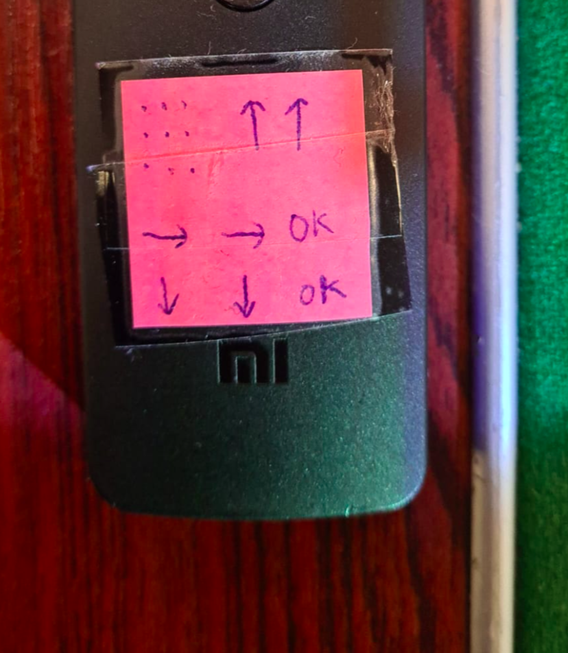

# DVIC Startup Manual

## How to launch the demo :

1. **Power on the projector :** one short press on the remote power button.

    *The projector takes 30 seconds to start*  

 

2. In the meantime, **launch the demo program :** unlock the computer (password : 5U*****). Open a terminal and type : `demo`.

    *The demo should start on the computer screen within seconds*

 

3. **Select the projector source to HDMI** : after step 1, the projector should now be displaying a home screen with some apps (like Netflix, Youtube, ...).

    Press continuously the sequence of buttons indicated on the remote (Menu ^ ^ > > OK v v OK)

    
 > OK v v OK" width="300" height="300" title="Sequence of buttons to press on the projector remote" >

    * **Note 1:** buttons may require to be pressed with force
    * **Note 2:** this sequence chooses HDMI 3 source. To connect on HDMI 2 source, press only once to the down (instead of two v v) at the end of the sequence.

 

## Frequently occuring problems :

Here are some common problems and their solutions :

### For step 1 : if the projector does not start

* Is the projector plugged in ? (check the power cable)
* Try to unplug the power cable, wait a few seconds, and plug it back in.
* The remote don't look to be recognised by the projector : change the remote batteries.
* Take a look to the projector manual (next to the PC)

### For step 2 : if the demo does not start

* Close the terminal and open a new one. Type `demo` again.
* try to restart the computer `sudo reboot`
* Is the camera plugged in ? (check the USB cable, it must be on a USB 3.0 port next to HDMI and DISPLAY PORT ports). Unplug and replug the camera.
* Some errors may appear in the terminal. Try to solve them.
* Launch a back-up saved Demo : `cd Desktop/gosai-demo-saved-1st-september` and `make stop && make boot`

### For step 3 : if the projector does not switch to HDMI

* Try to press the sequence of buttons again.
* Try to unplug the projector HDMI cable, wait a few seconds, and plug it back in. Repeat the sequence of buttons.
* Try to plug the HDMI in another port (HDMI 2 or HDMI 3)
* Try with another HDMI cable

### It works but the calibration is not good

* In a terminal : type `calibration` and follow the instruction. Relaunch `demo` after calibration.
* If it is still not working, try `calibration` again.

### For all steps : if the demo does not work

* Contact an interactive pool team member :)

